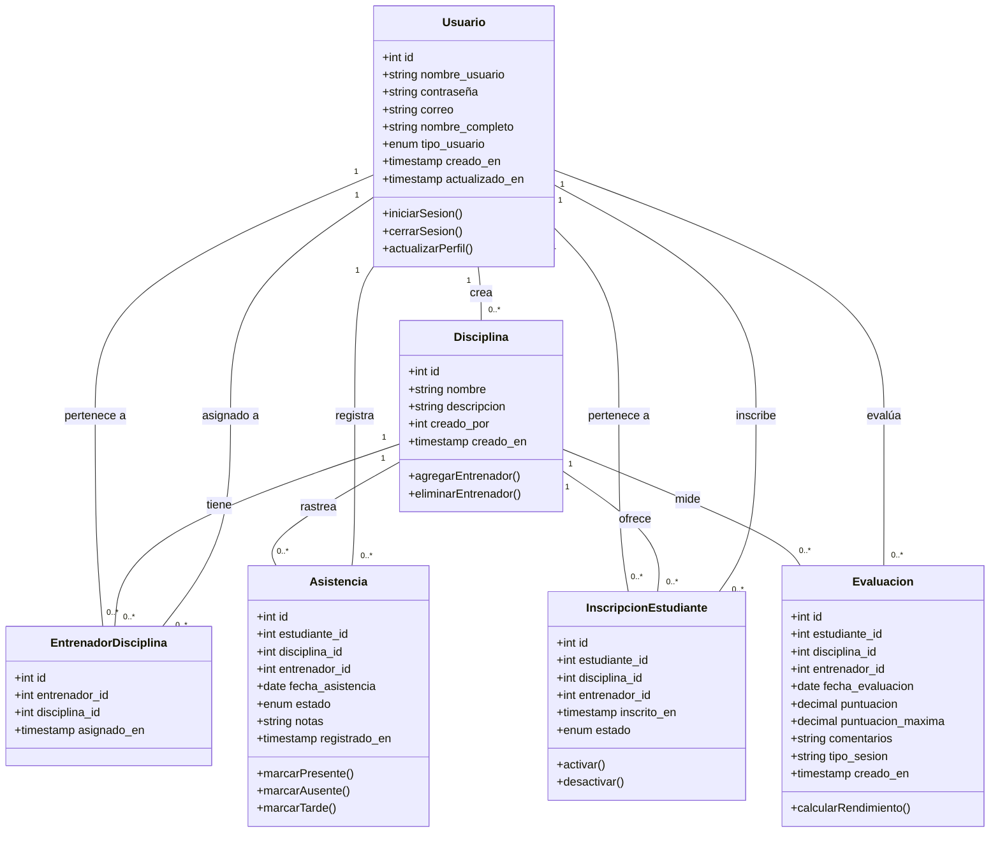
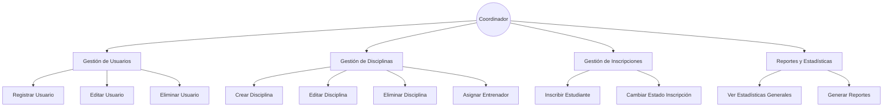
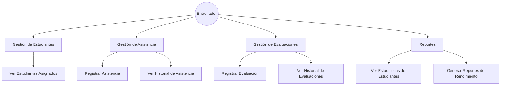
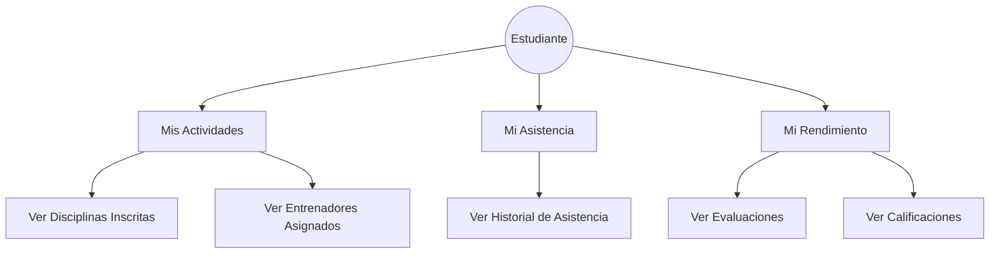
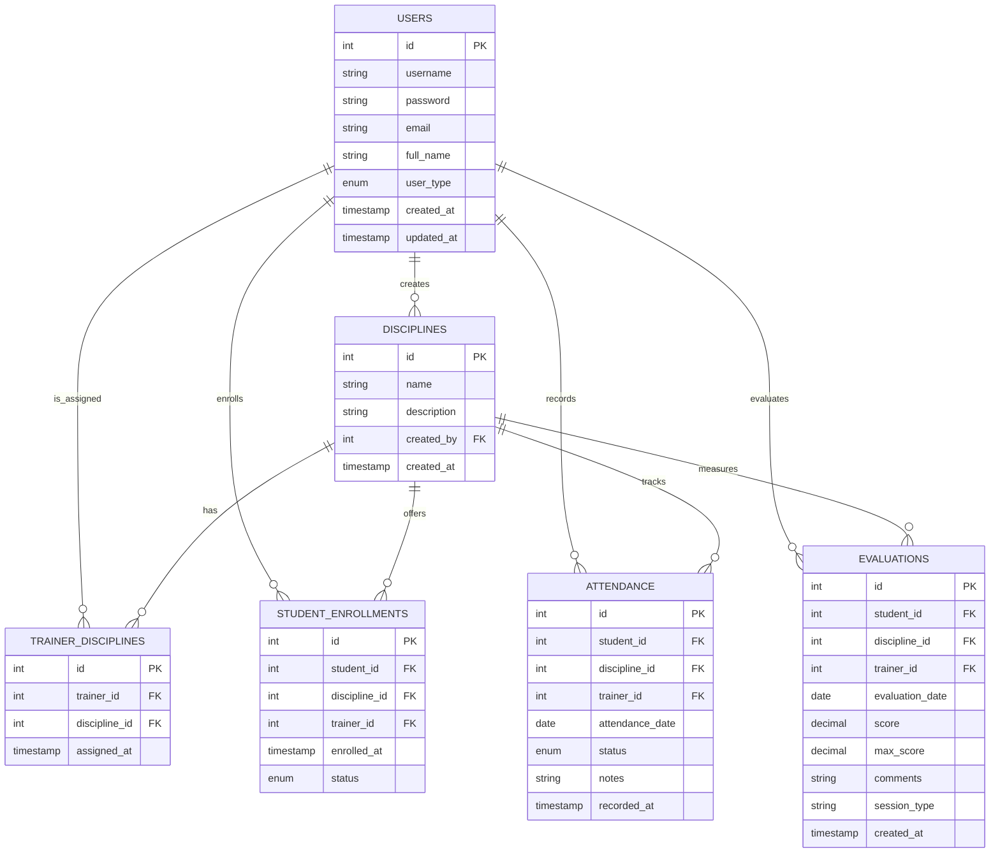

# Diagramas del Sistema de Gestión Deportiva

## Diagrama de Clases

## Diagramas de Casos de Uso

### Casos de Uso - Coordinador

### Casos de Uso - Entrenador

### Casos de Uso - Estudiante

## Diagrama de Relaciones entre Entidades

